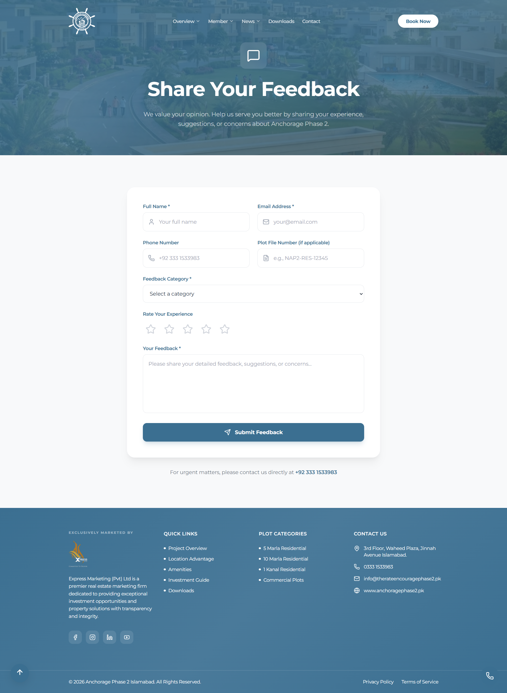
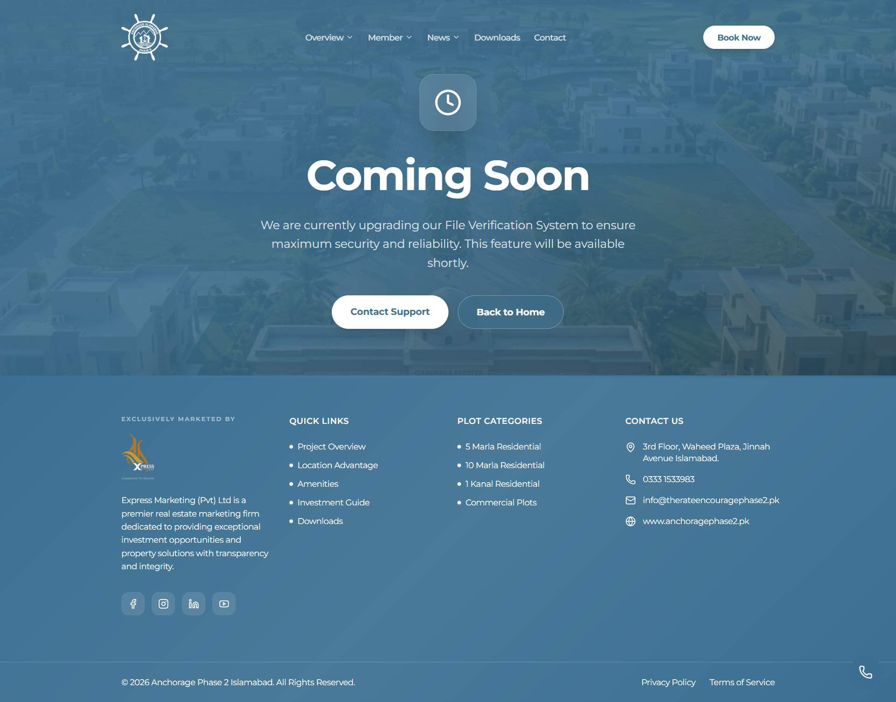

# Anchorage Phase 2 – Premium Real Estate Website

Official website developed for Anchorage Phase 2, a large-scale real estate housing project located near Thallian Interchange, Islamabad.

This platform was built to showcase premium plots, payment plans, amenities, and investor-focused information with a clean and high-performance UI.

---

## 🚀 Project Overview

Anchorage Phase 2 required a modern digital presence to position itself as a premium housing development. The goal was to create a responsive, visually strong, and conversion-driven website tailored to real estate investors.

The website emphasizes:

- Premium branding and visual hierarchy
- Clean navigation structure
- Responsive design across all devices
- Structured content presentation for payment plans and amenities
- Strong call-to-action strategy

---

## 🛠 Tech Stack

- React.js
- Tailwind CSS
- JavaScript (ES6+)
- Responsive Web Design Principles

---

## 🎯 My Role

- Front-End Development
- UI/UX Implementation
- Design-to-Code Conversion
- Responsive Layout Architecture
- Performance Optimization

---

## 🌍 Live Website

https://anchoragephase2.pk/

---

## 📸 Screenshots

  

  

  

  

  

## 🔒 Note

Due to client confidentiality agreements, the full source code cannot be shared publicly.  
This repository serves as a project showcase including visuals and documentation only.
